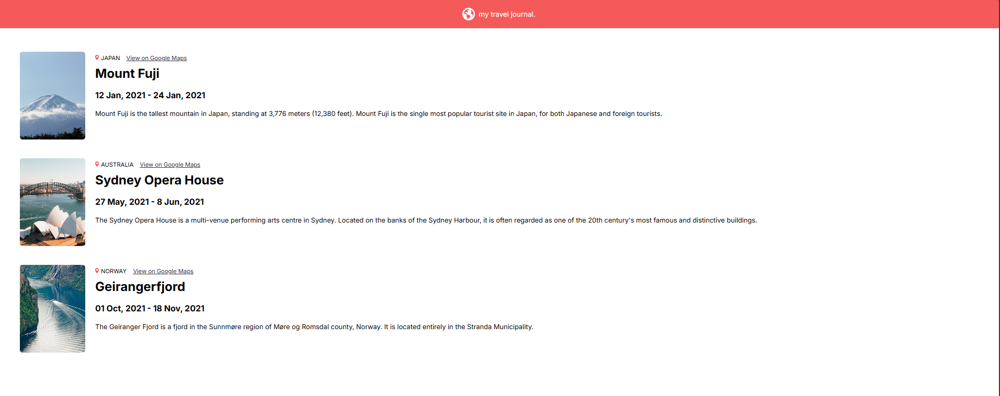

# Travel Journal

Travel Journal is a React application that displays travel destinations with images, location details, and descriptions, allowing users to explore different places around the world in a clean and responsive interface.

## Preview

## Live Demo
https://travel-journal-two-wheat.vercel.app/

## Features
- Destination cards with images and descriptions
- Location links to Google Maps
- Responsive layout
- Reusable React components

## Technologies
- React
- JavaScript
- Vite
- CSS

## How to run locally
npm install
npm run dev
